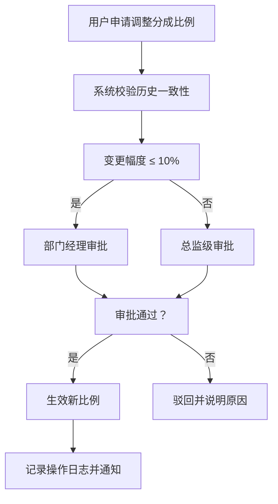

## 1. 产品概述

企业级多业务线收入分成与结算自动化管理系统，解决多业务线收入自动抓取、智能拆分、多级审批、自动对账、报告生成等全流程管理问题，提升财务结算效率，降低人工差错率。

- 主要目标用户：财务人员、业务总监、运营管理人员、系统管理员
- 核心价值：自动化处理每日数十万笔交易，实现收入全链路可追溯、可审计、可分析

## 2. 核心功能

### 2.1 用户角色

| 角色 | 注册方式 | 核心权限 |
|------|----------|----------|
| 财务人员 | 企业SSO登录 | 查看流水、处理对账、导出报告、执行调账 |
| 业务经理 | 企业SSO登录 | 查看本业务线数据、申请分成比例调整 |
| 财务总监 | 企业SSO登录 | 审批超10%分成变更、审批超预算结算、查看全局报表 |
| 系统管理员 | 企业SSO登录 | 系统配置、定时任务管理、日志审计、权限管理 |

### 2.2 功能模块

1. **仪表盘首页**：收入概览、关键指标、异常告警、快捷操作
2. **收入流水管理**：流水列表、自动抓取、多维度归类、流水详情
3. **分成规则管理**：分成比例配置、调整申请、审批流程、历史版本
4. **结算单管理**：每日结算单生成、审批流程、付款指令、支付状态
5. **银行对账中心**：自动对账、差异标记、调账工单、专项对账
6. **分析报告中心**：月度报告、趋势分析、图表可视化、PDF/Excel导出
7. **审批工作台**：待办审批、已办审批、审批历史、抄送通知
8. **系统管理**：用户权限、操作日志、系统配置、定时任务监控

### 2.3 页面详情

| 页面名称 | 模块名称 | 功能描述 |
|----------|----------|----------|
| 仪表盘 | 数据概览 | 今日/本月收入、各业务线占比、结算进度、差异率指标卡片 |
| 仪表盘 | 趋势图表 | 近30天收入趋势折线图、各业务线收入对比柱状图 |
| 仪表盘 | 异常告警 | 银行未到账、分成偏差、超预算等实时告警列表 |
| 收入流水 | 流水列表 | 分页查询、多条件筛选（业务线/渠道/客户/时间）、批量导出 |
| 收入流水 | 流水详情 | 单笔流水完整信息、拆分明细、关联结算单、操作日志 |
| 分成规则 | 规则列表 | 各业务线当前分成比例、生效时间、状态、操作按钮 |
| 分成规则 | 调整申请 | 修改比例、填写原因、提交审批、一致性校验提示 |
| 分成规则 | 审批详情 | 审批节点、审批意见、历史版本对比 |
| 结算单管理 | 结算单列表 | 每日结算单、状态（待审批/已审批/已支付）、预算对比 |
| 结算单管理 | 结算单详情 | 收入明细、拆分明细、付款指令、审批流程 |
| 银行对账 | 对账概览 | 今日对账进度、差异笔数、差异金额、差异率 |
| 银行对账 | 差异处理 | 差异列表、标记原因、生成调账工单、分配处理人 |
| 银行对账 | 专项对账 | 差异率超1%触发、专项对账流程、对账报告 |
| 分析报告 | 报告列表 | 月度报告、季度报告、自定义报告 |
| 分析报告 | 报告详情 | 收入趋势、分成占比、结算准确率、无差异率图表 |
| 分析报告 | 导出中心 | PDF导出（带图表）、Excel导出（明细数据） |
| 审批工作台 | 待办审批 | 待我审批、我发起的、抄送我的 |
| 审批工作台 | 审批详情 | 审批节点图、同意/驳回操作、填写审批意见 |
| 系统管理 | 操作日志 | 所有操作记录、筛选查询、导出审计 |
| 系统管理 | 定时任务 | 任务列表、执行状态、手动触发、任务日志 |

## 3. 核心流程

### 3.1 每日收入处理流程

每天凌晨自动执行：
1. 从各业务系统API抓取收入流水
2. 按产品线、渠道、客户维度自动归类
3. 根据生效的分成规则拆分每笔收入
4. 生成各业务线当日结算单
5. 超预算阈值自动发起审批
6. 审批通过后生成付款指令推送财务

### 3.2 银行对账流程

每日凌晨执行：
1. 拉取银行到账流水
2. 与系统收入流水自动匹配比对
3. 标记差异记录（金额不等、漏到账、多到账）
4. 生成调账工单分配财务人员
5. 当月累计差异率超1%自动触发专项对账

### 3.3 分成比例调整流程

### 3.4 月度报告生成流程

每月1日凌晨自动执行：
1. 汇总上月各业务线收入数据
2. 计算收入趋势、分成占比、结算准确率、无差异率
3. 生成可视化图表
4. 生成带图表的PDF和可编辑Excel
5. 推送通知相关人员

## 4. 用户界面设计

### 4.1 设计风格

**企业级专业金融风格**
- 主色调：深蓝色系（#165DFF）代表专业、可信赖
- 辅助色：绿色（#00B42A）代表成功/正常、橙色（#FF7D00）代表警告、红色（#F53F3F）代表错误/异常
- 中性色：深灰（#1D2129）、中灰（#4E5969）、浅灰（#C9CDD4）、背景（#F2F3F5）
- 按钮风格：圆角4px、主按钮蓝色填充、次按钮描边
- 字体：专业无衬线字体，标题18px/粗体、正文14px/常规、辅助文字12px
- 布局风格：卡片式布局、顶部导航+左侧菜单、数据表格为主
- 图标：线性图标，保持简洁专业

### 4.2 页面设计概述

| 页面名称 | 模块名称 | UI元素 |
|----------|----------|----------|
| 仪表盘 | 数据概览 | 4列指标卡片、带趋势箭头、数字动画效果 |
| 仪表盘 | 图表区域 | 2列布局，折线图+柱状图，交互悬浮提示 |
| 仪表盘 | 告警列表 | 左侧图标区分告警等级，右侧时间和状态 |
| 收入流水 | 筛选区 | 多条件筛选器，业务线/渠道/客户下拉选择 |
| 收入流水 | 数据表格 | 固定表头、斑马纹、行悬停高亮、操作列 |
| 分成规则 | 规则卡片 | 每条规则独立卡片，显示当前比例、生效时间、状态标签 |
| 结算单 | 状态标签 | 不同状态不同颜色（待审批-橙色、已审批-蓝色、已支付-绿色） |
| 银行对账 | 差异统计 | 顶部差异概览卡片，差异列表带原因标记 |
| 分析报告 | 图表展示 | 多图表组合：趋势图、饼图、柱状图、数据表格 |
| 审批详情 | 审批流程图 | 水平时间线，已通过-绿色、待审批-蓝色、已驳回-红色 |

### 4.3 响应式设计

- **Desktop-first**：优先适配1920px及以上桌面端
- 平板端：1024px-1919px，菜单折叠、表格可横向滚动
- 移动端：768px-1023px，底部导航、卡片式列表展示

### 4.4 动效设计

- 页面加载：数据卡片渐入+轻微上移动画，错开延迟
- 数字变化：指标数据从0到实际值的滚动动画
- 表格行：悬停时背景色过渡，选中行高亮
- 模态框：缩放+淡入动画
- 告警：新告警出现时轻微抖动+高亮闪烁
