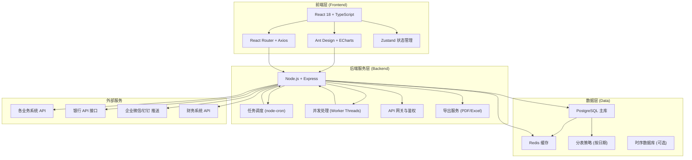
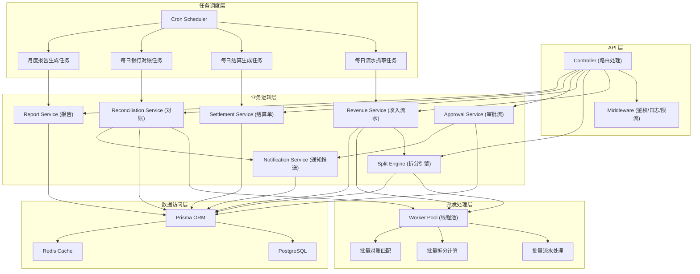
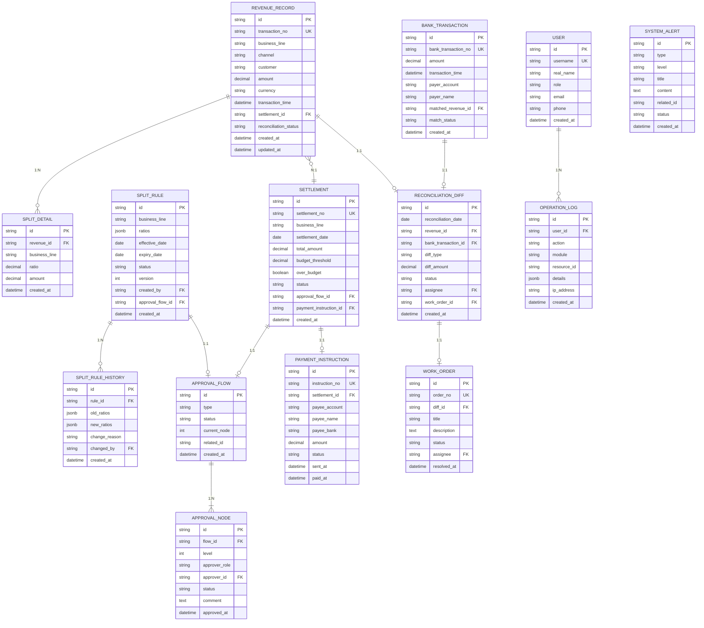

## 1. 架构设计



## 2. 技术栈描述

### 2.1 前端技术栈
- **框架**: React@18 + TypeScript@5
- **构建工具**: Vite@5
- **UI 组件库**: Ant Design@5
- **图表库**: ECharts@5
- **状态管理**: Zustand@4
- **路由**: React Router@6
- **HTTP 客户端**: Axios@1
- **样式**: TailwindCSS@3
- **PDF导出**: jspdf + html2canvas
- **Excel导出**: xlsx (SheetJS)

### 2.2 后端技术栈
- **运行时**: Node.js@20
- **Web框架**: Express@4
- **ORM**: Prisma@5
- **任务调度**: node-cron@3
- **并发处理**: Node.js Worker Threads + 线程池
- **消息队列**: Bull (Redis-based)
- **缓存**: Redis@7
- **鉴权**: JWT + bcrypt
- **日志**: Winston + 日志轮转

### 2.3 数据库
- **主数据库**: PostgreSQL@15（支持复杂查询、事务、JSONB）
- **缓存**: Redis@7（缓存热点数据、会话管理、消息队列）
- **分表策略**: 收入流水表按月份分表，应对百万级数据量

## 3. 路由定义

| 路由路径 | 页面名称 | 权限要求 |
|----------|----------|----------|
| /dashboard | 仪表盘首页 | 所有登录用户 |
| /revenue | 收入流水列表 | 财务/管理员 |
| /revenue/:id | 收入流水详情 | 财务/管理员 |
| /split-rules | 分成规则列表 | 所有登录用户 |
| /split-rules/apply | 分成调整申请 | 业务经理及以上 |
| /settlements | 结算单列表 | 财务/管理员 |
| /settlements/:id | 结算单详情 | 财务/管理员 |
| /reconciliation | 银行对账中心 | 财务/管理员 |
| /reconciliation/special | 专项对账 | 财务总监/管理员 |
| /reports | 分析报告列表 | 所有登录用户 |
| /reports/:id | 报告详情 | 所有登录用户 |
| /approvals | 审批工作台 | 所有登录用户 |
| /approvals/:id | 审批详情 | 相关审批人 |
| /system/logs | 操作日志 | 管理员 |
| /system/tasks | 定时任务管理 | 管理员 |
| /system/users | 用户权限管理 | 管理员 |
| /login | 登录页 | 公开 |

## 4. API 接口定义

```typescript
// 收入流水相关
interface RevenueRecord {
  id: string;
  transactionNo: string;
  businessLine: string;
  channel: string;
  customer: string;
  amount: number;
  currency: string;
  transactionTime: Date;
  splitDetails: SplitDetail[];
  settlementId?: string;
  reconciliationStatus: 'pending' | 'matched' | 'mismatch' | 'missing';
  createdAt: Date;
}

interface SplitDetail {
  businessLine: string;
  ratio: number;
  amount: number;
}

// 分成规则相关
interface SplitRule {
  id: string;
  businessLine: string;
  ratios: { [key: string]: number };
  effectiveDate: Date;
  expiryDate?: Date;
  status: 'draft' | 'pending_approval' | 'active' | 'inactive';
  version: number;
  createdBy: string;
  createdAt: Date;
}

// 结算单相关
interface Settlement {
  id: string;
  settlementNo: string;
  businessLine: string;
  settlementDate: Date;
  totalAmount: number;
  budgetThreshold: number;
  overBudget: boolean;
  status: 'pending_approval' | 'approved' | 'paid' | 'rejected';
  revenueIds: string[];
  paymentInstruction?: PaymentInstruction;
  approvalFlowId: string;
  createdAt: Date;
}

// 审批流相关
interface ApprovalFlow {
  id: string;
  type: 'split_change' | 'over_budget' | 'special_reconciliation';
  status: 'pending' | 'approved' | 'rejected';
  currentNode: number;
  nodes: ApprovalNode[];
  createdAt: Date;
}

interface ApprovalNode {
  id: string;
  level: number;
  approverRole: string;
  approverId?: string;
  status: 'pending' | 'approved' | 'rejected';
  comment?: string;
  approvedAt?: Date;
}

// 对账相关
interface BankTransaction {
  id: string;
  bankTransactionNo: string;
  amount: number;
  transactionTime: Date;
  payerAccount: string;
  payerName: string;
  matchedRevenueId?: string;
  matchStatus: 'pending' | 'matched' | 'excess' | 'unmatched';
}

interface ReconciliationDiff {
  id: string;
  reconciliationDate: Date;
  revenueId?: string;
  bankTransactionId?: string;
  diffType: 'amount_mismatch' | 'missing_bank' | 'excess_bank' | 'missing_system';
  diffAmount: number;
  status: 'pending' | 'resolved' | 'special';
  assignee?: string;
  workOrderId?: string;
}

// API 响应格式
interface ApiResponse<T> {
  code: number;
  message: string;
  data: T;
  timestamp: number;
}

interface PaginatedResponse<T> {
  items: T[];
  total: number;
  page: number;
  pageSize: number;
  totalPages: number;
}
```

### 核心 API 列表

| Method | Path | 描述 | 权限 |
|--------|------|------|------|
| GET | /api/revenue | 分页查询收入流水 | 财务/管理员 |
| GET | /api/revenue/:id | 获取单笔流水详情 | 财务/管理员 |
| POST | /api/revenue/fetch | 手动触发流水抓取 | 管理员 |
| GET | /api/split-rules | 获取分成规则列表 | 所有登录用户 |
| POST | /api/split-rules/apply | 提交分成调整申请 | 业务经理及以上 |
| GET | /api/settlements | 获取结算单列表 | 财务/管理员 |
| GET | /api/settlements/:id | 获取结算单详情 | 财务/管理员 |
| POST | /api/settlements/:id/approve | 审批结算单 | 相关审批人 |
| POST | /api/reconciliation/run | 执行对账 | 财务/管理员 |
| GET | /api/reconciliation/diffs | 获取差异列表 | 财务/管理员 |
| POST | /api/reconciliation/diffs/:id/resolve | 处理差异 | 财务/管理员 |
| GET | /api/reports/monthly/:yearMonth | 获取月度报告 | 所有登录用户 |
| GET | /api/reports/:id/export/pdf | 导出PDF报告 | 所有登录用户 |
| GET | /api/reports/:id/export/excel | 导出Excel报告 | 所有登录用户 |
| GET | /api/approvals/pending | 获取待办审批 | 所有登录用户 |
| POST | /api/approvals/:id/approve | 审批通过 | 相关审批人 |
| POST | /api/approvals/:id/reject | 审批驳回 | 相关审批人 |
| GET | /api/system/logs | 获取操作日志 | 管理员 |
| GET | /api/system/tasks | 获取定时任务状态 | 管理员 |
| POST | /api/system/tasks/:id/run | 手动触发定时任务 | 管理员 |

## 5. 后端服务架构



## 6. 数据模型

### 6.1 ER 图



### 6.2 DDL 索引设计

```sql
-- 收入流水表 (按月分表: revenue_record_202501, revenue_record_202502, ...)
CREATE TABLE IF NOT EXISTS revenue_record (
    id UUID PRIMARY KEY DEFAULT gen_random_uuid(),
    transaction_no VARCHAR(64) UNIQUE NOT NULL,
    business_line VARCHAR(32) NOT NULL,
    channel VARCHAR(64),
    customer VARCHAR(128),
    amount DECIMAL(18,4) NOT NULL,
    currency VARCHAR(8) DEFAULT 'CNY',
    transaction_time TIMESTAMP NOT NULL,
    settlement_id UUID,
    reconciliation_status VARCHAR(32) DEFAULT 'pending',
    created_at TIMESTAMP DEFAULT CURRENT_TIMESTAMP,
    updated_at TIMESTAMP DEFAULT CURRENT_TIMESTAMP
);

CREATE INDEX idx_revenue_business_line ON revenue_record(business_line);
CREATE INDEX idx_revenue_transaction_time ON revenue_record(transaction_time);
CREATE INDEX idx_revenue_settlement_id ON revenue_record(settlement_id);
CREATE INDEX idx_revenue_status ON revenue_record(reconciliation_status);
CREATE INDEX idx_revenue_channel ON revenue_record(channel);
CREATE INDEX idx_revenue_customer ON revenue_record(customer);

-- 分成规则表
CREATE TABLE IF NOT EXISTS split_rule (
    id UUID PRIMARY KEY DEFAULT gen_random_uuid(),
    business_line VARCHAR(32) UNIQUE NOT NULL,
    ratios JSONB NOT NULL,
    effective_date DATE NOT NULL,
    expiry_date DATE,
    status VARCHAR(32) DEFAULT 'draft',
    version INT DEFAULT 1,
    created_by UUID NOT NULL,
    approval_flow_id UUID,
    created_at TIMESTAMP DEFAULT CURRENT_TIMESTAMP
);

CREATE INDEX idx_split_rule_status ON split_rule(status);
CREATE INDEX idx_split_rule_effective ON split_rule(effective_date);

-- 结算单表
CREATE TABLE IF NOT EXISTS settlement (
    id UUID PRIMARY KEY DEFAULT gen_random_uuid(),
    settlement_no VARCHAR(64) UNIQUE NOT NULL,
    business_line VARCHAR(32) NOT NULL,
    settlement_date DATE NOT NULL,
    total_amount DECIMAL(18,4) NOT NULL,
    budget_threshold DECIMAL(18,4) NOT NULL,
    over_budget BOOLEAN DEFAULT FALSE,
    status VARCHAR(32) DEFAULT 'pending_approval',
    approval_flow_id UUID,
    payment_instruction_id UUID,
    created_at TIMESTAMP DEFAULT CURRENT_TIMESTAMP
);

CREATE INDEX idx_settlement_date ON settlement(settlement_date);
CREATE INDEX idx_settlement_business_line ON settlement(business_line);
CREATE INDEX idx_settlement_status ON settlement(status);

-- 银行交易表
CREATE TABLE IF NOT EXISTS bank_transaction (
    id UUID PRIMARY KEY DEFAULT gen_random_uuid(),
    bank_transaction_no VARCHAR(128) UNIQUE NOT NULL,
    amount DECIMAL(18,4) NOT NULL,
    transaction_time TIMESTAMP NOT NULL,
    payer_account VARCHAR(64),
    payer_name VARCHAR(128),
    matched_revenue_id UUID,
    match_status VARCHAR(32) DEFAULT 'pending',
    created_at TIMESTAMP DEFAULT CURRENT_TIMESTAMP
);

CREATE INDEX idx_bank_transaction_time ON bank_transaction(transaction_time);
CREATE INDEX idx_bank_match_status ON bank_transaction(match_status);
CREATE INDEX idx_bank_matched_revenue ON bank_transaction(matched_revenue_id);

-- 对账差异表
CREATE TABLE IF NOT EXISTS reconciliation_diff (
    id UUID PRIMARY KEY DEFAULT gen_random_uuid(),
    reconciliation_date DATE NOT NULL,
    revenue_id UUID,
    bank_transaction_id UUID,
    diff_type VARCHAR(32) NOT NULL,
    diff_amount DECIMAL(18,4) NOT NULL,
    status VARCHAR(32) DEFAULT 'pending',
    assignee UUID,
    work_order_id UUID,
    created_at TIMESTAMP DEFAULT CURRENT_TIMESTAMP
);

CREATE INDEX idx_diff_date ON reconciliation_diff(reconciliation_date);
CREATE INDEX idx_diff_status ON reconciliation_diff(status);
CREATE INDEX idx_diff_type ON reconciliation_diff(diff_type);
CREATE INDEX idx_diff_assignee ON reconciliation_diff(assignee);

-- 操作日志表 (按月分表)
CREATE TABLE IF NOT EXISTS operation_log (
    id UUID PRIMARY KEY DEFAULT gen_random_uuid(),
    user_id UUID NOT NULL,
    action VARCHAR(64) NOT NULL,
    module VARCHAR(64) NOT NULL,
    resource_id UUID,
    details JSONB,
    ip_address VARCHAR(45),
    created_at TIMESTAMP DEFAULT CURRENT_TIMESTAMP
);

CREATE INDEX idx_log_user_id ON operation_log(user_id);
CREATE INDEX idx_log_created_at ON operation_log(created_at);
CREATE INDEX idx_log_module ON operation_log(module);
CREATE INDEX idx_log_action ON operation_log(action);
```

## 7. 高并发处理方案

### 7.1 批量数据处理
- 使用 **Worker Threads** 创建线程池，并发处理流水拆分计算
- 每批次处理 1000 条流水，采用流式处理避免内存溢出
- 使用 **Redis 分布式锁** 防止任务重复执行

### 7.2 数据库优化
- 收入流水按月分表，减少单表数据量
- 读写分离，查询走只读实例
- 热点数据（分成规则、用户信息）Redis 缓存
- 批量写入使用 `INSERT ... ON CONFLICT` 或 `COPY` 命令

### 7.3 接口限流
- 使用 **Redis + 令牌桶算法** 实现接口限流
- 按用户角色配置不同限流阈值
- 批量导出接口异步处理，返回任务ID轮询

### 7.4 定时任务高可用
- 使用 **Redis Redlock** 实现分布式任务锁
- 任务执行状态持久化，支持断点续跑
- 任务超时自动告警，失败自动重试（最多3次）
